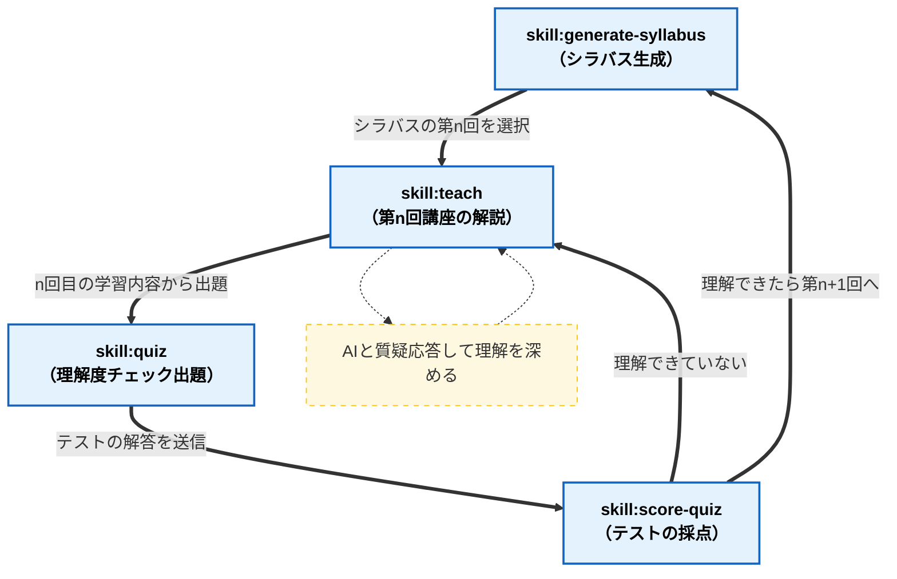

# CLAUDE-ACADEMY

## 概要

任意の技術について体系的に学習するためのプラットフォームです。
体系的な学習のためのカリキュラムの作成、カリキュラムに沿った講座解説、各回毎の理解度テストの出力と採点を行うことができます。

### 特徴

- htmlでコンテンツを出力するので読みやすく、後で読み返すことがしやすく、複数人で出力物を共有しやすいです。
  - 同じhtmlを見ながらAIに質疑応答を受けることができるのも特長です。
- インタラクティブなhtmlでテストを出力するため、Webサービスのような使用感で学習できます。

## 使い方

下記のスキルがあります。

- `/generate-syllabus`
- `/teach`
- `/quiz`
- `/score-quiz`

### generate-syllabus

体系的な学習のためのカリキュラムをシラバスとして出力します。

- このシラバスをベースに後続のスキルが機能します。
- 5~10回の講座に分割して体系的に学べる構成が作成されます。
- 3段階のレベル(beginner, standard, advanced)で講座が展開されるので、advancedはいったんスキップする、beginnerだけ学習して実務のとっかかりにする、などの使い方を想定しています。

### teach

出力されたシラバスに沿って、n回目の講座の解説を受けられます。

- この解説のhtmlをAIと共有して質疑応答をして理解を深めます。

### quiz

n回目の講座内容の理解度をチェックする問を出題します。

- インタラクティブなhtmlで解答することができます。
- テストはローカルサーバー（`skills/quiz/serve-test.py`）経由で`http://127.0.0.1:<ポート>/test.html`として開かれます。「回答を保存」を押すと`kaitou.json`が講座フォルダへ直接書き出されるため、ダウンロードフォルダからの移動は不要です。
  - サーバーは1時間無操作で自動終了します。`score-quiz`実行時にも停止されます。
  - `test.html`を`file://`で直接開いた場合は、従来どおりダウンロードフォルダに保存されます（この場合のみ手動で講座フォルダへ移動が必要）。

### score-quiz

quizのテストへの解答を採点します。

